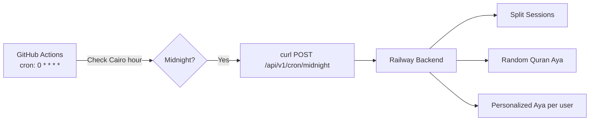

# Features & Infrastructure Implementation Plan

2 feature-level issues: cron job reliability in production and drag & drop for tasks/subtasks.

---

## Feature 1: Cron Jobs Not Working in Production

### Current Architecture



**What exists:**
- [cron.yml](file:///d:/Projects/sukoon/.github/workflows/cron.yml) — runs every hour, checks if it's midnight in Cairo, then `curl`s the backend.
- [cron.controller.ts](file:///d:/Projects/sukoon/backend/src/modules/cron/cron.controller.ts) — fires 3 background jobs (sessions split, quran aya, personalized aya per user).
- [cronAuth.ts](file:///d:/Projects/sukoon/backend/src/shared/middleware/cronAuth.ts) — validates `CRON_SECRET` query param.
- The controller responds `202` immediately and runs jobs in the background (no `await`).

### Root Cause Investigation

The GitHub Actions approach can fail for several reasons:

1. **GitHub Actions schedule is unreliable** — GitHub doesn't guarantee exact cron timing. Jobs can be delayed 5-30+ minutes or even skipped entirely during peak load.
2. **Railway cold starts** — If the Railway backend is on a hobby/starter plan and sleeps, the `curl` request may time out before the server wakes up.
3. **Secret misconfiguration** — `BACKEND_URL` or `CRON_SECRET` might not match between GitHub Secrets and Railway environment variables.
4. **Network/firewall issues** — Railway may block or rate-limit requests from GitHub Actions IPs.

### Proposed Approach: In-Process `node-cron`

The most reliable approach for a single-instance Railway deployment is to run the scheduler **inside the Express server** itself. This eliminates all external dependencies (GitHub Actions, network calls, secret management).

> [!WARNING]
> In-process cron only works correctly with a **single server instance**. If you scale to multiple Railway replicas, each instance would run the cron jobs independently (duplicate execution). For multi-instance, you'd need a distributed lock (e.g., Redis-based). For now, single instance is fine.

#### [NEW] `backend/src/shared/utils/scheduler.ts`
- Install `node-cron` package.
- Create a `startScheduler()` function that registers cron jobs:
  ```
  // Run at midnight Cairo time (UTC+2 = 22:00 UTC, but account for DST)
  // Use Africa/Cairo timezone directly with node-cron v3+
  cron.schedule('0 0 * * *', runMidnightJobs, { timezone: 'Africa/Cairo' });
  ```
- The `runMidnightJobs` function calls the same 3 functions from `cron.controller.ts`:
  - `runSplittingSessions()`
  - `runQuranAya()`
  - `runPersonalizedQuranAya()`
- Extract the job functions from the controller into a shared `cron.jobs.ts` file so they can be used by both the HTTP endpoint and the scheduler.

#### [MODIFY] [cron.controller.ts](file:///d:/Projects/sukoon/backend/src/modules/cron/cron.controller.ts)
- Extract `runSplittingSessions`, `runQuranAya`, `runPersonalizedQuranAya` into a new file:

#### [NEW] `backend/src/modules/cron/cron.jobs.ts`
- Move all 3 job functions here.
- Export them for use by both `cron.controller.ts` (HTTP trigger) and `scheduler.ts` (in-process cron).

#### [MODIFY] [server.ts](file:///d:/Projects/sukoon/backend/src/server.ts)
- After server starts listening, call `startScheduler()`.
- Only start the scheduler in production (`process.env.NODE_ENV === 'production'`).

#### Keep the HTTP endpoint
- Keep `POST /api/v1/cron/midnight` as a manual trigger for testing/debugging.
- Keep the GitHub Actions workflow as a **backup** — it can serve as a fallback if Railway restarts and misses midnight.

### Steps

1. `npm install node-cron` + `npm install -D @types/node-cron` in the backend.
2. Create `cron.jobs.ts` with extracted job functions.
3. Create `scheduler.ts` with `node-cron` setup.
4. Update `server.ts` to call `startScheduler()`.
5. Update `cron.controller.ts` to import from `cron.jobs.ts`.
6. Test locally by setting the cron to run every minute, verify logs.
7. Deploy to Railway and verify via logs that midnight jobs fire.

> [!NOTE]
> The GitHub Actions workflow can remain as-is for now. It serves as a redundant trigger. The `cron.controller.ts` jobs are idempotent enough (creating a new aya / personalized aya per day) that double-execution once in a while is harmless.

---

## Feature 2: Drag & Drop (Reorder Tasks, Move to Tag/List, Reorder Subtasks)

### Current State

- **No DnD library** installed in the frontend.
- **No `position` column** on `Task` or `SubTask` in [schema.prisma](file:///d:/Projects/sukoon/backend/prisma/schema.prisma). Tasks are ordered by `id asc` or `dueDate asc`.
- The Zod schema already accepts `position` in [tasks.schema.ts](file:///d:/Projects/sukoon/backend/src/modules/task/tasks/tasks.schema.ts#L12) (create + update), but the Prisma model doesn't have it, so it's ignored.
- [TaskSection.tsx](file:///d:/Projects/sukoon/frontend/src/components/features/tasks/TaskSection.tsx) renders tasks in a flat list with Framer Motion animations.
- [SubTaskItem.tsx](file:///d:/Projects/sukoon/frontend/src/components/features/subtasks/SubTaskItem.tsx) renders subtasks in a flat list.

### Library Choice: `@dnd-kit`

Recommended: **@dnd-kit** (specifically `@dnd-kit/core` + `@dnd-kit/sortable` + `@dnd-kit/utilities`).

Why:
- Modern React DnD library designed for hooks-based React.
- Excellent accessibility (keyboard DnD) out of the box.
- Works great with Framer Motion (you already use it).
- Lightweight and tree-shakeable.
- Supports both sortable lists and droppable zones (for tag/list assignment).

### Phase 1: Database Schema (Backend)

#### [MODIFY] [schema.prisma](file:///d:/Projects/sukoon/backend/prisma/schema.prisma)

Add `position` columns:

```prisma
model Task {
  // ... existing fields ...
  position    Int       @default(0)    // NEW
  // ...
}

model SubTask {
  // ... existing fields ...
  position    Int       @default(0)    // NEW
  // ...
}
```

- Run `npx prisma migrate dev --name add-position-fields`.
- Backfill existing tasks/subtasks with sequential positions (a migration script or a one-time endpoint).

### Phase 2: Backend API Endpoints

#### [NEW] Reorder Tasks Endpoint — `PATCH /api/v1/tasks/reorder`

```ts
// Body: { orderedIds: [5, 2, 8, 1] }
// Sets position = index for each task ID
```

- **Controller:** Accept `orderedIds: number[]` in the body.
- **Service:** For each ID at index `i`, update `position = i`.
- **Repository:** Use a Prisma transaction to batch-update positions.
- **Auth:** Ensure all task IDs belong to the authenticated user.

#### [NEW] Reorder Subtasks Endpoint — `PATCH /api/v1/subtasks/:taskId/reorder`

```ts
// Body: { orderedIds: [3, 1, 4] }
```

- Same pattern as task reorder, scoped to a specific `taskId`.

#### [MODIFY] Task Queries — Update `orderBy`

All task queries in [tasks.repository.ts](file:///d:/Projects/sukoon/backend/src/modules/task/tasks/tasks.repository.ts) that currently use `orderBy: { id: "asc" }` should change to:
```ts
orderBy: [{ position: "asc" }, { id: "asc" }]
```

Same for subtask queries in [subtasks.repository.ts](file:///d:/Projects/sukoon/backend/src/modules/task/subtasks/subtasks.repository.ts).

#### Move Task to List/Tag (Already Supported)

The existing `PATCH /api/v1/tasks/:id` already supports updating `listId` and `tagIds`. No new endpoints needed — DnD just needs to call the existing `updateTask` mutation with the new `listId` or `tagIds`.

### Phase 3: Frontend — DnD Setup

#### Install Dependencies

```bash
npm install @dnd-kit/core @dnd-kit/sortable @dnd-kit/utilities
```

#### [MODIFY] [TaskSection.tsx](file:///d:/Projects/sukoon/frontend/src/components/features/tasks/TaskSection.tsx)

- Wrap the task list in a `SortableContext` from `@dnd-kit/sortable`.
- Each `TaskItem` becomes a `useSortable` item.
- On drag end, compute the new order and call the reorder API.
- Use `DndContext` with sensors (PointerSensor + KeyboardSensor) for accessibility.

#### [MODIFY] [TaskItem.tsx](file:///d:/Projects/sukoon/frontend/src/components/features/tasks/TaskItem.tsx)

- Add a drag handle (grip icon) visible on hover.
- Use `useSortable` hook to get `attributes`, `listeners`, `setNodeRef`, `transform`, `transition`.
- Apply transform styles for the smooth drag animation.

#### [MODIFY] [SubTaskItem.tsx](file:///d:/Projects/sukoon/frontend/src/components/features/subtasks/SubTaskItem.tsx)

- Same pattern: wrap subtask list in `SortableContext`.
- Each subtask item uses `useSortable`.
- On drag end, call the subtask reorder API.

#### [MODIFY] [TaskList.tsx](file:///d:/Projects/sukoon/frontend/src/components/features/tasks/TaskList.tsx)

- Wrap the entire task list area in a `DndContext`.
- Configure drop zones for:
  - **Reordering within a section** (sortable).
  - **Dropping onto sidebar list/tag items** (droppable) to move a task to a list or tag.

### Phase 4: Frontend — Sidebar Drop Zones

#### Sidebar List Items and Tag Items
- Each list item and tag item in the sidebar becomes a `useDroppable` target.
- When a task is dragged over a list/tag in the sidebar, show a visual highlight.
- On drop, call `updateTask({ id, data: { listId } })` or `updateTask({ id, data: { tagIds: [...currentTags, newTagId] } })`.

### Phase 5: Frontend Hooks

#### [NEW] `useReorderTasks` hook
```ts
export function useReorderTasks() {
  const queryClient = useQueryClient();
  return useMutation({
    mutationFn: (orderedIds: number[]) => taskService.reorderTasks(orderedIds),
    onSuccess: () => queryClient.invalidateQueries({ queryKey: taskKeys.all }),
  });
}
```

#### [NEW] `useReorderSubtasks` hook
```ts
export function useReorderSubtasks() {
  const queryClient = useQueryClient();
  return useMutation({
    mutationFn: ({ taskId, orderedIds }) => subTaskService.reorderSubtasks(taskId, orderedIds),
    onSuccess: (_, vars) => {
      queryClient.invalidateQueries({ queryKey: subtaskKeys.list(vars.taskId) });
    },
  });
}
```

### Implementation Order

1. **Schema migration** — Add `position` to Task and SubTask.
2. **Backend endpoints** — Reorder tasks, reorder subtasks, update `orderBy`.
3. **Frontend: Task reorder** — Install @dnd-kit, wrap TaskSection, make TaskItem sortable.
4. **Frontend: Subtask reorder** — Wrap SubTaskItem list in SortableContext.
5. **Frontend: Drag to list/tag** — Add droppable zones to sidebar items.

> [!IMPORTANT]
> **Optimistic updates are critical** for DnD to feel responsive. On drag-end, immediately reorder the local React Query cache, then fire the API call. If the API fails, roll back to the previous order.

---

## Verification Plan

### Cron Jobs
- Set cron to `* * * * *` (every minute) in dev, verify log output.
- Deploy to Railway, check logs at midnight Cairo for job execution.
- Manually trigger `POST /api/v1/cron/midnight` to verify HTTP endpoint still works.

### Drag & Drop
- **Reorder tasks:** Drag a task up/down → refresh page → verify order persists.
- **Reorder subtasks:** Drag subtasks within the SubTaskPanel → verify order persists.
- **Move to list:** Drag a task from inbox to a list in the sidebar → verify `listId` updates.
- **Move to tag:** Drag a task onto a tag → verify the tag is added to the task.
- **Keyboard accessibility:** Use Tab + Space/Enter to pick up, arrow keys to move, Space to drop.
- **Mobile touch:** Verify drag works on mobile with touch sensors.
